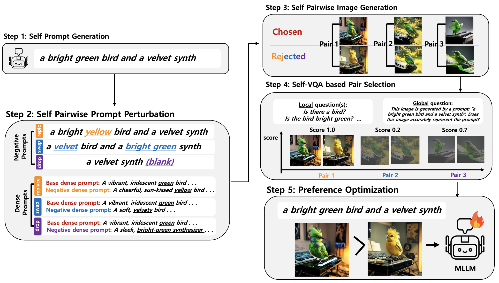

# OSPO
This repository contains the official implementation for the paper: **Object-centric Self-improving Preference Optimization for Text-to-Image Generation**.



## 📍 About
**OSPO** is a self-improving prefernece optimization framework for compositional text-to-image generation, allowing an MLLM to improve its fine-grained image generation capability without needing any data or external model. 


## 📍 Setup
1. Create Conda Environment
```bash
conda create -n ospo python=3.8 -y
conda activate ospo
```

2. Clone this repository
```bash
git clone https://github.com/OSPO-NeurIPS2025/OSPO.git
cd OSPO
```

3. Install Dependencies
```bash
# We use pytorch 2.0.1 CUDA 11.7 Version
conda install pytorch==2.0.1 torchvision==0.15.2 torchaudio==2.0.2 pytorch-cuda=11.7 -c pytorch -c nvidia

# Install Dependencies
pip install -r requirements.txt
```

4. Download Janus-Pro-7B Model
- Janus-Pro-7B: 🤗[HuggingFace](https://huggingface.co/deepseek-ai/Janus-Pro-7B)
- Make `./checkpoints` directory and place the Model in the `./checkpoints` directory.
- So the Model folder path should be `./checkpoints/Janus-Pro-7B`


## 📍 Inference
1. For inference, please download the weights from the following link:
- Janus-Pro-7B trained by **OSPO** Framework: [Google Drive](https://drive.google.com/file/d/1AI42LfljJ5nl2YZ-AVuD0sziYs0KB_yx/view?usp=sharing)
2. Place the checkpoint in the `./checkpoints` directory.
3. So the checkpoint path should be `./checkpoints/ospo-epoch1.ckpt`

4. Run the script.
```bash
bash scripts/run_inference.sh
```
Results will be saved in `./results`

## 📍 Reproduce
For OSPO framework, we generate synthetic preference data and train the LLM backbone using SimPO based on the generated data.

1. Configure the files `step1.yaml` to `step5.yaml` located in the `./configs` directory.
- The `data_path` field is optional and does not need to be specified.
- The `max_len` field specifies the number of generated samples per category; the total number of samples will be `max_len * 4`.
2. Run the script. 
```bash
bash scripts/run.sh
```
We uploaded the example data generated by the OSPO framework in the `./examples` directory. 

However if you want to run each step individually, use the commands below.
### Step 1. Prompt Generation
> **Note:** You must run the script separately for each category.
```bash
CUDA_VISIBLE_DEVICES=N python ospo/step1.py --category object
CUDA_VISIBLE_DEVICES=N python ospo/step1.py --category color
CUDA_VISIBLE_DEVICES=N python ospo/step1.py --category shape
CUDA_VISIBLE_DEVICES=N python ospo/step1.py --category texture
CUDA_VISIBLE_DEVICES=N python ospo/step1.py --category spatial
CUDA_VISIBLE_DEVICES=N python ospo/step1.py --category non-spatial
CUDA_VISIBLE_DEVICES=N python ospo/step1.py --category complex
```
### Step 2. Pairwise Prompt Perturbation
```bash
CUDA_VISIBLE_DEVICES=N python ospo/step2.py
```
### Step 3. Image Generation
```bash
CUDA_VISIBLE_DEVICES=N python ospo/step3.py
```
### Step 4. Self-VQA based Preference Pair Selection
```bash
CUDA_VISIBLE_DEVICES=N python ospo/step4.py 
```
### Step 5. Training
> **Note:** The final training dataset constructed from Step 4 is available at `./examples/step4/train.json`.
```bash
CUDA_VISIBLE_DEVICES=N python ospo/step5.py 
```


## 📍 Acknowledgement
We thank the authors of [Janus-Pro](https://github.com/deepseek-ai/Janus?tab=readme-ov-file#janus-pro) and [SimPO](https://github.com/princeton-nlp/SimPO), for making their code available.


## 📍 TODO
- [x] Release the model checkpoint.
- [x] Release the inference code for text-to-image generation.
- [x] Rlease the OSPO framework code.
- [ ] Release the train dataset.
- [ ] Release the evaluation code.
